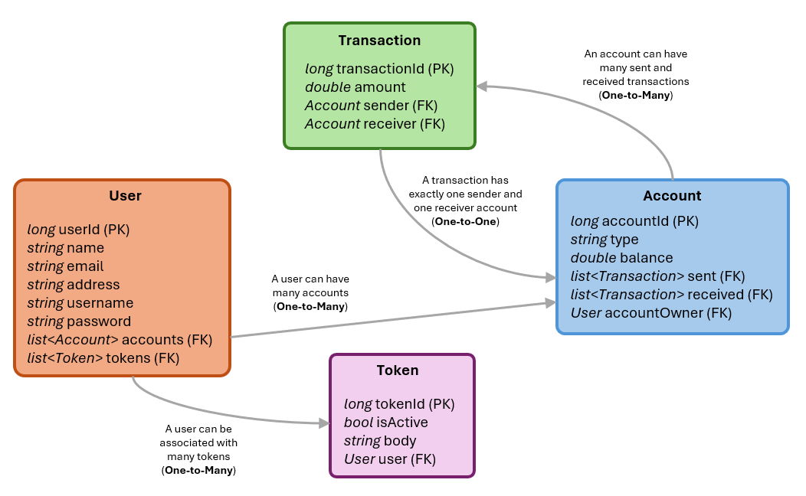
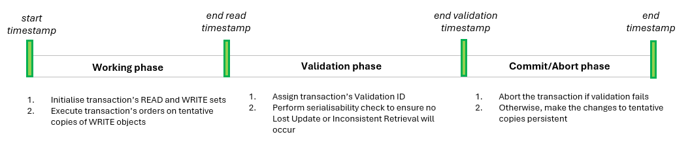
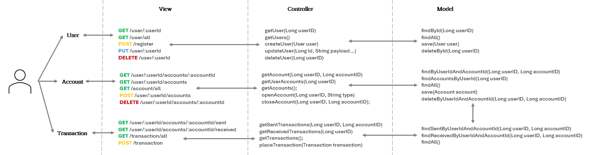
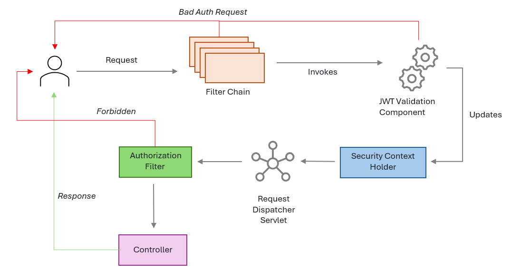
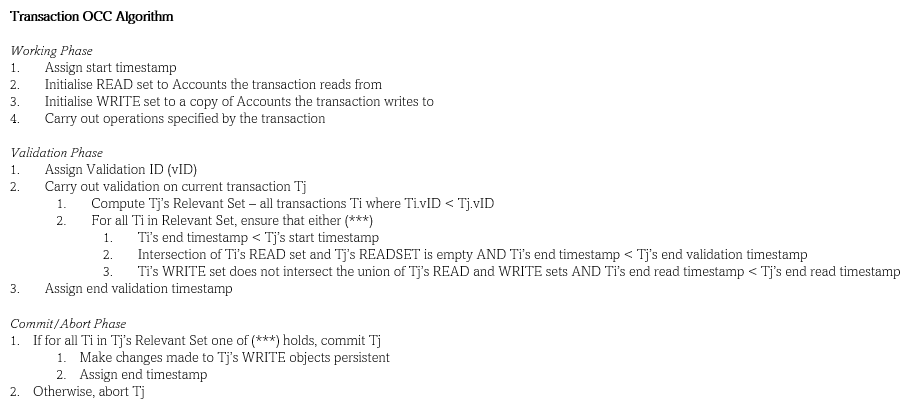

# Concurrency API Developer Notes

### API Components Overview

## Database Schema

## Transaction Entity

### API Architecture Overview

## Model-View-Controller Architecture

## Security Architecture

## Optimistic Concurrency Control Algorithm

### API Endpoints Overview

Open endpoints require no Authentication.

* [Register](next/markdown/auth/register.md) : `POST /register`
* [Login](next/markdown/auth/login.md) : `POST /authenticate`

Protected endpoints require a valid token to be included in the request header under the 'Authorization' key.
This token can be obtained by logging-in on the `/authenticate` route.

* [Logout](next/markdown/auth/logout.md) : `POST /logout`

#### Base User (Customer) Endpoints

Each endpoint allows the user associated with the provided token to
manipulate and interact with their resources, including their user profile,
accounts, and transactions. 

* [View Profile](next/markdown/user/viewProfile.md) : `GET /user/:userId`
* [Create Profile](next/markdown/auth/register.md) : `POST /register`
* [Edit Profile](next/markdown/user/updateProfile.md) : `PUT /user/:userId`
* [Delete Profile](next/markdown/user/deleteProfile.md) : `DELETE /user/:userId`

* [View Account](next/markdown/account/viewAccount.md) : `GET /user/:userId/accounts/:accountId`
* [View User's Accounts](next/markdown/account/viewAllUserAccounts.md) : `GET /user/:userId/accounts`
* [Open Account](next/markdown/account/openAccount.md) : `POST /user/:userId/accounts`
* [Close Account](next/markdown/account/closeAccount.md) : `DELETE /user/:userId/accounts/:accountId`

* [View Account's Sent Transactions](next/markdown/account/viewAccountSentTransactions.md) : `GET /user/:userId/accounts/:accountId/sent`
* [View Account's Received Transactions](next/markdown/account/viewAccountReceivedTransactions.md) : `GET /user/:userId/accounts/:accountId/received`
* [Place Transaction](next/markdown/transaction/placeTransaction.md) : `POST /user/:userId/accounts/:accountId/place`

#### Super User (Admin) Endpoints

Admin can view all resources provided by the API and manage their own user profile, but are restricted in having their
own accounts and sending/receiving transactions.

* [View all Profiles](next/markdown/admin/viewAllProfiles.md) : `GET /user/all`
* [View all Accounts](next/markdown/admin/viewAllAccounts.md) : `GET /account/all`
* [View all Transactions](next/markdown/admin/viewAllTransactions.md) : `GET /transaction/all`
